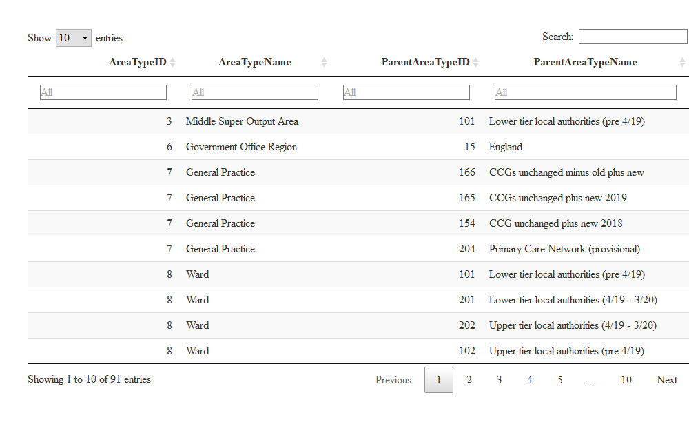
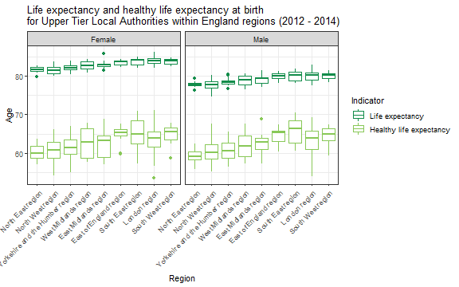

```r
knitr::opts_chunk$set(fig.path = "charts-")
```

This worked example attempts to document a common workflow a user might follow when using the `fingertipsR` package.

`fingertipsR` provides users the ability to import data from the [Fingertips](http://fingertips.phe.org.uk/) website. Fingertips is a major repository of public health indicators in England. The site is structured in the following way:

* Profiles - these contain indicators related to a broad theme (such as a risk factor or a disease topic etc)
* Domains - these are subcategories of profiles, and break the profiles down to themes within the broader theme
* Indicators - this is the lowest level of the structure and sit within the domains. Indicators are presented at different time periods, geographies, sexes, ageband and categories.

This example demonstrates how you can plot healthy life expectancy and life expectancy by geographical regions for a given year of data that fingertips contains. So, *where to start*?

## Where to start

There is one function in the `fingertipsR` package that imports data from the Fingertips API; `fingertips_data()`. This function has the following inputs:

* IndicatorID
* AreaCode
* DomainID
* ProfileID
* AreaTypeID
* ParentAreaTypeID

At least one of *IndicatorID*, *DomainID* or *ProfileID* must be complete. These fields relate to each other as described in the introduction. *AreaTypeID* is also required, and determines the geography for which data is imported. In this case we want County and Unitary Authority level. *AreaCode* needs completing if you are extracting data for a particular area or group of areas only. *ParentAreaTypeID* requires an area type code that the *AreaTypeID* maps to at a higher level of geography. For example, County and Unitary Authorities map to a higher level of geography called Government Office Regions. These mappings can be identified using the `area_types()` function. If ignored, a *ParentAreaTypeID* will be chosen automatically.

Therefore, the inputs to the `fingertips_data` function that we need to find out are the ID codes for:

* IndicatorID 
* AreaTypeID
* ParentAreaTypeID

We need to begin by calling the `fingertipsR` package: 


```r
library(fingertipsR)
```

## IndicatorID

There are two indicators we are interested in for this exercise. Without consulting the [Fingertips website](https://fingertips.phe.org.uk/  "Fingertips"), we know approximately what they are called:

* Healthy life expectancy
* Life expectancy

We can use the `indicators()` function to return a list of all the indicators within Fingertips. We can then filter the name field for the term *life expectancy* (note, the IndicatorName field has been converted to lower case in the following code chunk to ensure matches will not be overlooked as a result of upper case letters).


```r
inds <- indicators_unique()
life_expectancy <- inds[grepl("life expectancy", tolower(inds$IndicatorName)),]
```


| IndicatorID|IndicatorName                                                                       |
|-----------:|:-----------------------------------------------------------------------------------|
|       90362|Healthy life expectancy at birth                                                    |
|       90366|Life expectancy at birth                                                            |
|       90825|Inequality in healthy life expectancy at birth ENGLAND                              |
|       91102|Life expectancy at 65                                                               |
|       92031|Inequality in healthy life expectancy at birth LA                                   |
|       92901|Inequality in life expectancy at birth                                              |
|       93190|Inequality in life expectancy at 65                                                 |
|       93505|Healthy life expectancy at 65                                                       |
|       93523|Disability-free life expectancy at 65                                               |
|       93562|Disability-free life expectancy at birth                                            |
|         650|Life expectancy - MSOA based                                                        |
|       93249|Disability free life expectancy, (Upper age band 85+)                               |
|       93283|Life expectancy at birth, (upper age band 90+)                                      |
|       93285|Life expectancy at birth, (upper age band 85+)                                      |
|       93298|Healthy life expectancy, (upper age band 85+)                                       |
|       92641|Life expectancy at 75 (SPOT: NHSOD 1b)                                              |
|       90365|Gap in life expectancy at birth between each local authority and England as a whole |

The two indicators we are interested in from this table are:

* 90362
* 90366

## AreaTypeID

We can work out what the *AreaTypeID* codes we need using the function `area_types()`. We've decided that we want to produce the graph at County and Unitary Authority level. From the section [Where to start] we need codes for *AreaTypeID* and *ParentAreaTypeID.*


```r
areaTypes <- area_types()
```



The table shows that the *AreaTypeID* for County and Unitary Authority level is 202. The third column, *ParentAreaTypeID*, shows the IDs of the area types that these map to. In the case of County and Unitary Authorities, these are:


| AreaTypeID|AreaTypeName                               | ParentAreaTypeID|ParentAreaTypeName                        |
|----------:|:------------------------------------------|----------------:|:-----------------------------------------|
|        202|Upper tier local authorities (4/19 - 3/20) |                6|Government Office Region                  |
|        202|Upper tier local authorities (4/19 - 3/20) |              104|PHEC 2015 new plus PHEC 2013 unchanged    |
|        202|Upper tier local authorities (4/19 - 3/20) |            10105|Depriv. decile (IMD2015, 4/19 boundaries) |
|        202|Upper tier local authorities (4/19 - 3/20) |            10113|Depriv. deciles (IMD2019)                 |
|        202|Upper tier local authorities (4/19 - 3/20) |              126|Combined authorities                      |

*ParentAreaTypeID* is 6 by default for the `fingertips_data()` function for `AreaTypeID` of 202 (this value changes if different `AreaTypeID`s are entered), so we can stick with that in this example. Use the `area_types()` function to understand more about how areas map to each other.

## Extracting the data

Finally, we can use the `fingertips_data()` function with the inputs we have determined previously.


```r
indicators <- c(90362, 90366)
data <- fingertips_data(IndicatorID = indicators,
                        AreaTypeID = 202)
```


```
## 
## 
## |  &nbsp;  | IndicatorID |      IndicatorName       | ParentCode |
## |:--------:|:-----------:|:------------------------:|:----------:|
## | **8023** |    90366    | Life expectancy at birth | E12000005  |
## | **8024** |    90366    | Life expectancy at birth | E12000006  |
## | **8025** |    90366    | Life expectancy at birth | E12000008  |
## | **8026** |    90366    | Life expectancy at birth | E12000005  |
## | **8027** |    90366    | Life expectancy at birth | E12000008  |
## | **8028** |    90366    | Life expectancy at birth | E12000005  |
## 
## Table: Table continues below
## 
##  
## 
## |  &nbsp;  |       ParentName       | AreaCode  |    AreaName    |
## |:--------:|:----------------------:|:---------:|:--------------:|
## | **8023** |  West Midlands region  | E10000028 | Staffordshire  |
## | **8024** | East of England region | E10000029 |    Suffolk     |
## | **8025** |   South East region    | E10000030 |     Surrey     |
## | **8026** |  West Midlands region  | E10000031 |  Warwickshire  |
## | **8027** |   South East region    | E10000032 |  West Sussex   |
## | **8028** |  West Midlands region  | E10000034 | Worcestershire |
## 
## Table: Table continues below
## 
##  
## 
## |  &nbsp;  |        AreaType         |  Sex   |   Age    | CategoryType | Category |
## |:--------:|:-----------------------:|:------:|:--------:|:------------:|:--------:|
## | **8023** | County & UA (4/19-3/20) | Female | All ages |      NA      |    NA    |
## | **8024** | County & UA (4/19-3/20) | Female | All ages |      NA      |    NA    |
## | **8025** | County & UA (4/19-3/20) | Female | All ages |      NA      |    NA    |
## | **8026** | County & UA (4/19-3/20) | Female | All ages |      NA      |    NA    |
## | **8027** | County & UA (4/19-3/20) | Female | All ages |      NA      |    NA    |
## | **8028** | County & UA (4/19-3/20) | Female | All ages |      NA      |    NA    |
## 
## Table: Table continues below
## 
##  
## 
## |  &nbsp;  | Timeperiod | Value | LowerCI95.0limit | UpperCI95.0limit |
## |:--------:|:----------:|:-----:|:----------------:|:----------------:|
## | **8023** | 2017 - 19  | 83.45 |      83.24       |      83.66       |
## | **8024** | 2017 - 19  | 84.25 |      84.02       |      84.47       |
## | **8025** | 2017 - 19  | 85.33 |      85.15       |      85.51       |
## | **8026** | 2017 - 19  | 83.85 |      83.58       |      84.11       |
## | **8027** | 2017 - 19  | 84.21 |        84        |      84.42       |
## | **8028** | 2017 - 19  | 83.8  |      83.54       |      84.06       |
## 
## Table: Table continues below
## 
##  
## 
## |  &nbsp;  | LowerCI99.8limit | UpperCI99.8limit | Count | Denominator | Valuenote |
## |:--------:|:----------------:|:----------------:|:-----:|:-----------:|:---------:|
## | **8023** |        NA        |        NA        |  NA   |     NA      |    NA     |
## | **8024** |        NA        |        NA        |  NA   |     NA      |    NA     |
## | **8025** |        NA        |        NA        |  NA   |     NA      |    NA     |
## | **8026** |        NA        |        NA        |  NA   |     NA      |    NA     |
## | **8027** |        NA        |        NA        |  NA   |     NA      |    NA     |
## | **8028** |        NA        |        NA        |  NA   |     NA      |    NA     |
## 
## Table: Table continues below
## 
##  
## 
## |  &nbsp;  |     RecentTrend      | ComparedtoEnglandvalueorpercentiles |
## |:--------:|:--------------------:|:-----------------------------------:|
## | **8023** | Cannot be calculated |               Similar               |
## | **8024** | Cannot be calculated |               Better                |
## | **8025** | Cannot be calculated |               Better                |
## | **8026** | Cannot be calculated |               Better                |
## | **8027** | Cannot be calculated |               Better                |
## | **8028** | Cannot be calculated |               Better                |
## 
## Table: Table continues below
## 
##  
## 
## |  &nbsp;  | ComparedtoRegionvalueorpercentiles | TimeperiodSortable | Newdata |
## |:--------:|:----------------------------------:|:------------------:|:-------:|
## | **8023** |               Better               |      20170000      |   NA    |
## | **8024** |               Better               |      20170000      |   NA    |
## | **8025** |               Better               |      20170000      |   NA    |
## | **8026** |               Better               |      20170000      |   NA    |
## | **8027** |              Similar               |      20170000      |   NA    |
## | **8028** |               Better               |      20170000      |   NA    |
## 
## Table: Table continues below
## 
##  
## 
## |  &nbsp;  | Comparedtogoal |
## |:--------:|:--------------:|
## | **8023** |       NA       |
## | **8024** |       NA       |
## | **8025** |       NA       |
## | **8026** |       NA       |
## | **8027** |       NA       |
## | **8028** |       NA       |
```

The data frame returned by `fingertips_data()` contains 26 variables.  For this exercise, we are only interested in a few of them and for the time period 2012-14:

* IndicatorID
* AreaCode
* ParentAreaName
* Sex
* Timeperiod
* Value

The data frame also contains data for the parent area, and for England, so we want to filter it to remove these too.


```r
cols <- c("IndicatorID", "AreaCode", "ParentName", "Sex", "Timeperiod", "Value")

area_type_name <- table(data$AreaType) # tally each group in the AreaType field

area_type_name <- area_type_name[area_type_name == max(area_type_name)] # pick the group with the highest frequency
area_type_name <- names(area_type_name) # retrieve the name

data <- data[data$AreaType == area_type_name & 
               data$Timeperiod == "2012 - 14", cols]
```

## Plotting outputs

Using `ggplot2` it is possible to plot the outputs.


```r
library(ggplot2)
ggplot(data, aes(x = reorder(ParentName, Value, median), y = Value, col = factor(IndicatorID))) + 
        geom_boxplot(data = data[data$IndicatorID == 90366, ]) +
        geom_boxplot(data = data[data$IndicatorID == 90362, ]) +
        facet_wrap(~ Sex) +
        scale_colour_manual(name = "Indicator",
                            breaks = c("90366", "90362"),
                            labels = c("Life expectancy", "Healthy life expectancy"),
                            values = c("#128c4a", "#88c857")) +
        labs(x = "Region",
             y = "Age",
             title = "Life expectancy and healthy life expectancy at birth \nfor Upper Tier Local Authorities within England regions (2012 - 2014)") +
        theme_bw() +
        theme(axis.text.x = element_text(angle = 45,
                                         hjust = 1))
```



## Other useful functions

The plot above makes use of the fields that are within the dataset by default when using the `fingertips_data()` function. There is also a `deprivation_decile()` function, which provides an indicator of deprivation for each geographical area (see `?deprivation_decile`). 

Not all indicators are available for every geography. To understand how indicators are mapped to different gegoraphies, there is a function `indicator_areatypes()`.

To understand more about what comprises each indicator, there is the `indicator_metadata()` function, which provides the information on the definitions page of the Fingertips website.

Finally, the `nearest_neighbours()` function provides groups of statistically similar area for some of the geographies that are available. The geographies these are available for, and their sources, are documented within the function documentation (`?nearest_neighbours`).
